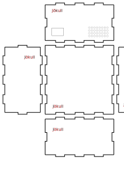

# Simon Says

Það er fúlt að ég náði ekki að klára verkefnið út af london ferðinni en hér er það sem ég er kominn með.

Ég bjó til logo í inkscape og hannaði boxið þar líka. Boxið er tilbúið en það brotnaði smá.

Rafrásin virkaði rétt þegar ég setti hana upp á brauðbretti og ég gat alveg spilað leikinn.

Ég lóðaði allt og gerði það ansi vel en því miður hafði ég ekki nægan tíma til að klára verkefnið. Myndir eru hér fyrir neðan.

